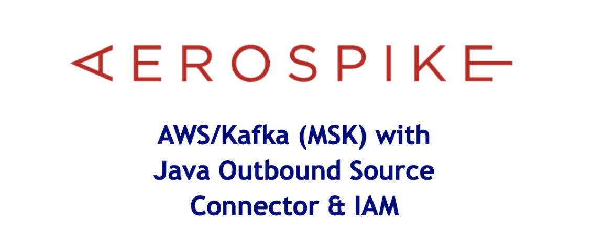
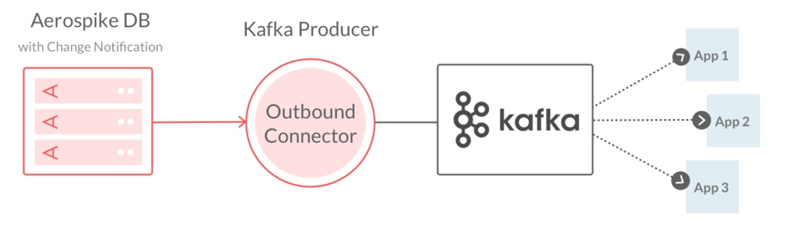
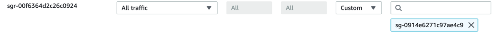
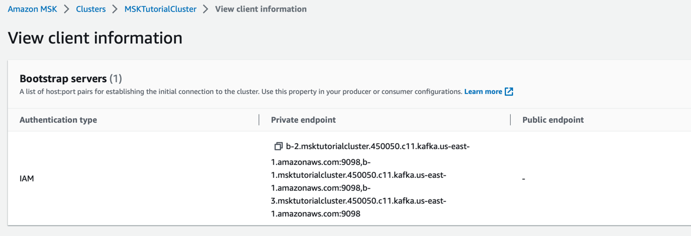
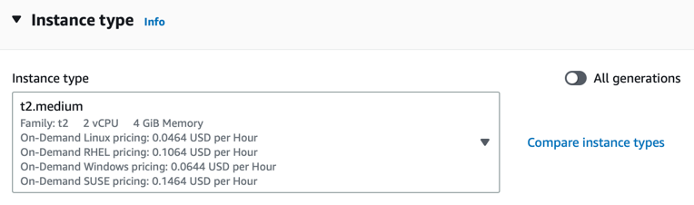
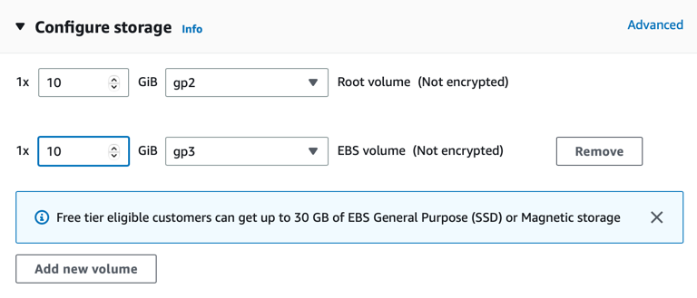

<p align="center">

</p>

In this article we create an AWS MSK Kafka resource using AWS IAM Roles 
and Policies to authenticate user access. We then create an Aerospike Database
cluster and insert some sample messages which in turn get shipped to AWS Kafka 
via the Aerospike Kafka Source connector. The article is focused around using IAM to 
authenticate clients and will guide the reader step by step on how to 
achieve this.
<div align="center">. . . .</div>



## AWS MKS Kafka

In this section we setup a simple 3 node Kafka cluster. 
- From the AWS Console select MSK service, then create a new cluster, selecting Quick Create
- Select the Provisioned cluster type and select instance type ```kafka.t3.small```
- Select the EBS storage and a size of 10 GB
- Make a note of the VPC, Subnets and the Security group ID as you will need these later.

Next create the IAM Policy and Roles

- Again from the AWS Console, select the IAM service.
   - Create a new IAM Policy by opening the JSON tab and pasting in the following, replacing
  **region:Account-ID**. 
     
   - Save the policy and name it:  *msk-tutorial-policy*
```json
{
    "Version": "2012-10-17",
    "Statement": [
        {
            "Effect": "Allow",
            "Action": [
                "kafka-cluster:Connect",
                "kafka-cluster:AlterCluster",
                "kafka-cluster:DescribeCluster"
            ],
            "Resource": [
                "arn:aws:kafka:region:Account-ID:cluster/MSKTutorialCluster/*"
            ]
        },
        {
            "Effect": "Allow",
            "Action": [
                "kafka-cluster:*Topic*",
                "kafka-cluster:WriteData",
                "kafka-cluster:ReadData"
            ],
            "Resource": [
                "arn:aws:kafka:region:Account-ID:topic/MSKTutorialCluster/*"
            ]
        },
        {
            "Effect": "Allow",
            "Action": [
                "kafka-cluster:AlterGroup",
                "kafka-cluster:DescribeGroup"
            ],
            "Resource": [
                "arn:aws:kafka:region:Account-ID:group/MSKTutorialCluster/*"
            ]
        }
    ]
}
```
- Create the IAM Role
   - Under Common Use Cases, select EC2 and then next.
   - Under permissions, select the policy named *msk-tutorial-policy* and then next.
  - Give the role a name like *msk-tutorial-role* and click the Create Role button.

## Kafka Client Machine

Next we create a client machine where we install the necessary Kafka tools to access our MSK cluster.

- Create a new ec2 instance type t2.micro
- Use the default AMI: Amazon Linux 2023 AMI 2023.0.20230322.0 x86_64 HVM kernel-6.1
  
  - The AMI may be different depending on your region. 
  
- Create a key pair if required
- Under [Advanced Options.IAM instance profile], select the IAM Role created earlier
- Launch the instance. 
- Under instances launched, choose the instance you just created. Click on the security tab and 
  make a note of the security group associated with this instance.
  
  - e.g.: sg-0914e6271c97ae4c9 (launch-wizard-1)
  
- Open the VPC section
  https://console.aws.amazon.com/vpc/
  
    - Then click on Security Groups on the left hand menu
    - Find the security group from the MSK cluster and click on it.
 
  - e.g.: sg-e5f51dfb
  
  - Choose edit Inbound Rules
  - Create a new rule to allow all traffic from the new ec2 instance


  > 


## Kafka Topics
So you've succesfully created your first Kafka cluster and Kafka client machine. Now 
go ahead and test you can access the MSK cluster by creating a topic, producing and consuming 
some sample messages confirming everything is working as expected.

- From the MSK Cluster make a note of the Kafka version being used. 
  - In this example we are using 2.8.1
- From the Kafka client machine install Java 11+
  - ```sudo yum -y install java-11```
  
- Download and untar Apache Kafka
  - ```wget https://archive.apache.org/dist/kafka/2.8.1/kafka_2.12-2.8.1.tgz```
  - ```tar -xzf kafka_2.12-2.8.1.tgz```
  
- To use IAM we will need the MSK IAM Auth jar file. Download the jar to the Kafka libs folder

  - ```cd kafka_2.12-2.8.1/libs/```
  - ```wget https://github.com/aws/aws-msk-iam-auth/releases/download/v1.1.1/aws-msk-iam-auth-1.1.1-all.jar```
  - ```cd ../bin/```
  
  - Create a file to use when authenticating to MSK. It will define the SASL mechanism to use and reference the Java class
file that will handle the IAM callbacks.
```bash
cat <<EOF> client.properties
security.protocol=SASL_SSL
sasl.mechanism=AWS_MSK_IAM
sasl.jaas.config=software.amazon.msk.auth.iam.IAMLoginModule required;
sasl.client.callback.handler.class=software.amazon.msk.auth.iam.IAMClientCallbackHandler
EOF
```

Go to the AWS Console and view the MSK Cluster Client Information. You will see the screen below.
There will be 3 endpoints we can use but for this illustration we only require one.
- Example choose:
  
  - ```b-2.msktutorialcluster.450050.c11.kafka.us-east-1.amazonaws.com:9098``` 
  


### Creating Topics

From the kafka/bin folder run the command to create a topic called `aerospike-airforce-1`

```bash
export BootstrapServerString="b-2.msktutorialcluster.450050.c11.kafka.us-east-1.amazonaws.com:9098"
./kafka-topics.sh --create --bootstrap-server $BootstrapServerString --command-config client.properties --replication-factor 3 --partitions 1 --topic aerospike-airforce-1
```
### Listing Topics
To list the topics created run the command below. Notice our latest topic called `aerospike-airforce-1` 

```bash 
./kafka-topics.sh --bootstrap-server $BootstrapServerString --command-config client.properties --list
MSKTutorialTopic
__amazon_msk_canary
__consumer_offsets
aerospike
aerospike-airforce-1
```

### Produce and Consumer

As much as this is Kafka-101 and quite rudimentary it makes sense to test our setup by sending and receiving 
messages from the designated Kafka topic. 

Produce some message via a console window. Open a new window and run the following Kafka producer command.
Type 3 or 4 messages entering the 'return' key after each.
```text
./kafka-console-producer.sh --broker-list $BootstrapServerString --producer.config client.properties --topic aerospike-airforce-1
>Instrument Check
>Pre flight checks confirmed
>Ready for takeoff
```

We are noe ready to consume these messages. Open a new window and run the following
```text
./kafka-console-consumer.sh --bootstrap-server $BootstrapServerString --consumer.config client.properties --topic aerospike-airforce-1 --from-beginning
Instrument Check
Pre flight checks confirmed
Ready for takeoff
```

## Aerospike Database Source
So just a quick recap on what we have done so far. We created a Kafka 3 node cluster in AWS using MSK with IAM.
We successfully created topics, produced and consumed messages using our IAM credentials.

The next stage of our journey is to install out Aerospike Database and insert some message. Set up 
our XDR ( Cross Data Centre Replication component ) to send data to the Kafka Source Connector. This will
in turn send the messages to MSK.

Create the Aerospike Database as follows by firstly creating a new ec2 instance.

- Recommend using Linux Centos
  - Rocky 8 AMI: ami-043ceee68871e0bb5 ( us-east-1 )

  
  

- Select the instance type as t2.medium

    - Use t2.medium for e.g.

  

 - Add the extra volume for Aerospike storage

   - Simple EBS volume is all that is required for now
  
  

 - Launch the instance and ssh onto the host.
 - If you have an Aerospike License feature file upload it to the instance.
 - Install the Aerospike Database Server
```text
export VER="6.1.0.2"
sudo yum install java python3 openssl-devel wget git gcc maven bind-utils sysstat nc -y
wget -O aerospike-tools.tgz 'https://www.aerospike.com/download/tools/latest/artifact/el8'
tar -xvf aerospike-tools.tgz
cd aerospike-tools_8.1.0_el8_x86_64
sudo ./dep-check
sudo ./asinstall
wget -O aerospike.tgz https://enterprise.aerospike.com/enterprise/download/server/$VER/artifact/el8
tar -xvf aerospike.tgz
cd aerospike-server-enterprise-$VER-el8
sudo ./asinstall
sudo mkdir -p /var/log/aerospike/
sudo systemctl enable aerospike

```
- Confirm the data storage disk for aerospike data is available
```bash
lsblk
NAME    MAJ:MIN RM SIZE RO TYPE MOUNTPOINT
xvda    202:0    0  10G  0 disk
└─xvda1 202:1    0  10G  0 part /
xvdb    202:16   0  10G  0 disk   <<----------------- This one!
```
- Replace the Aerospike configration file under /etc/aerospike/aerospike.conf with the following.
 
  - Under ```heartbeat.address``` add in your internal 172.x.x.x address.
  - For ```xdr.dc.node-address-port``` enter the {kafka-client-machine-address}:8080 
```yaml
# Aerospike database configuration file for use with systemd.

service {
  # paxos-single-replica-limit 1 # Number of nodes where the replica count is automatically
  proto-fd-max 15000
  service-threads 10
  feature-key-file /etc/aerospike/features.conf
  node-id A1
  cluster-name CLA
}

logging {
  file /var/log/aerospike/aerospike.log {
    context any info
  }
}

# public and private addresses
network {
  service {
    address any
    port 3000
  }

  heartbeat {
    mode mesh
    address 172.31.94.201
    port 3002 # Heartbeat port for this node.
    interval 150 # controls how often to send a heartbeat packet
    timeout 10 # number of intervals after which a node is considered to be missing
  }

  fabric {
    port 3001
  }

  info {
    port 3003
  }
}

namespace test {
  replication-factor 2
  memory-size 40G
  default-ttl 0
  index-type shmem
  high-water-disk-pct 50
  high-water-memory-pct 60
  stop-writes-pct 90
  nsup-period 0

  storage-engine device {
    device /dev/xvdb
    data-in-memory false
    write-block-size 128K
    min-avail-pct 5
  }
}

xdr {
  # Change notification XDR block that round-robins between two connector nodes
  dc aerospike-kafka-source {
    connector true
    node-address-port 172.31.58.190 8080
    namespace test {
    }
  }
}
```
- Start the Aerospike Service
```bash
sudo cp features.conf /etc/aerospike/
sudo systemctl start aerospike
sudo systemctl status aerospike
```

## Aerospike Kafka Source Connector

From the Kafka Client instance we can go ahead an [install](https://docs.aerospike.com/connect/kafka/from-asdb/installing#installing-on-linux) the Aerospike Kafka Source Connector. This 
is our outbound connector to send data from the Aerospike database to MSK.

```bash 
sudo yum install java #( install 11+ JDK )
wget https://enterprise.aerospike.com/artifacts/enterprise/aerospike-kafka-outbound/5.0.1/aerospike-kafka-outbound-5.0.1-1.noarch.rpm
sudo rpm -i aerospike-kafka-outbound-5.0.0-1.noarch.rpm
```

Configure the outbound connector. Note outbound and source connector are used interchangeably 
in this article.

Add the following contents to the file ```/etc/aerospike-kafka-outbound/aerospike-kafka-outbound.yml```.
Replacing the broker address for one of the nodes in the Kafka cluster under
```producer-props.bootstrap.servers```

```yaml
# Change the configuration for your use case.
#
# Refer to https://www.aerospike.com/docs/connectors/enterprise/kafka/outbound/configuration/index.html
# for details.

# The connector's listening ports, TLS and network interface.
service:
  port: 8080

# Format of the Kafka destination message.
format:
  mode: flat-json
  metadata-key: metadata

# Aerospike record routing to a Kafka destination.
routing:
  mode: static
  destination: aerospike

# Kafka producer initialization properties.
producer-props:
  bootstrap.servers:
    - b-3.msktutorialcluster.450050.c11.kafka.us-east-1.amazonaws.com:9098
  ssl.truststore.location: /etc/aerospike-kafka-outbound/kafka.client.truststore.jks
  ssl.truststore.password: changeit
  security.protocol: SASL_SSL
  sasl.mechanism: AWS_MSK_IAM
  sasl.jaas.config: software.amazon.msk.auth.iam.IAMLoginModule required awsProfileName=default;
  sasl.client.callback.handler.class: software.amazon.msk.auth.iam.IAMClientCallbackHandler

# The logging properties.
logging:
  file: /var/log/aerospike-kafka-outbound/aerospike-kafka-outbound.log
  enable-console-logging: true
  levels:
    root: debug
    record-parser: debug
    server: debug
    com.aerospike.connect: debug
  ticker-interval: 3600
```

Create the ca certificate trust store for use in the config kafaka outbound connector config.
```bash
sudo cp /usr/lib/jvm/java-11-amazon-corretto/lib/security/cacerts /etc/aerospike-kafka-outbound/kafka.client.truststore.jks
sudo chmod 755 /etc/aerospike-kafka-outbound/kafka.client.truststore.jks
```

You will need a copy the AWS IAM Kafka Auth Jar to made available to the connector. If you recall
we downloaded this earlier and added the jar to the kafka/libs folder.
```bash
sudo cp kafka_2.12-2.8.1/libs/aws-msk-iam-auth-1.1.1-all.jar /opt/aerospike-kafka-outbound/lib/aws-msk-iam-auth-1.1.1-all.jar
```

Start the service
```bash
sudo systemctl enable aerospike-kafka-outbound
sudo systemctl start aerospike-kafka-outbound
```

## Sending Data from Aerospike to Kafka


Open a separate window so we can list all messages on the aerospike kafka topic. Start by adding the one of the private endpoint bootstrap server to a shell variable for ease.
```text
export BootstrapServerString="b-3.msktutorialcluster.450050.c11.kafka.us-east-1.amazonaws.com:9098"
```
Run the comsumer client as follows
```text
./kafka-console-consumer.sh --bootstrap-server $BootstrapServerString --consumer.config client.properties --topic aerospike --from-beginning
```

In a new window start the aql client which connects to your Aerospike Database.
```text
aql --auth EXTERNAL_INSECURE -U iam-real -P secret-pwd
```
Insert some data
```text
insert into test (pk,a) values(400,"Your winning lottery ticket")
```
Check to see if the data was seen in the Kafka Consumer window
```text
{"metadata":{"namespace":"test","userKey":400,"digest":"W7eGav2hKfOU00xx7mnOPYa2uCo=","msg":"write","gen":1,"lut":1681488437767,"exp":0},"a":"Your winning lottery ticket"}
```

## Conclusion

In this article we successuly looked at how easy it is to send data from Aerospike to Kafka authenticating clients via AWS IAM permissions.
We created an Aerospike Database from scratch, setup our AWS MSK Kafka cluster and also used the Aerospike Outbound Kafka Connector
to easily build a realtime streaming data pipeline.

