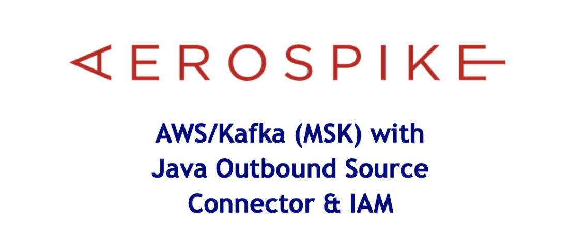
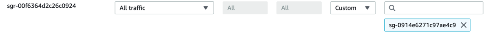
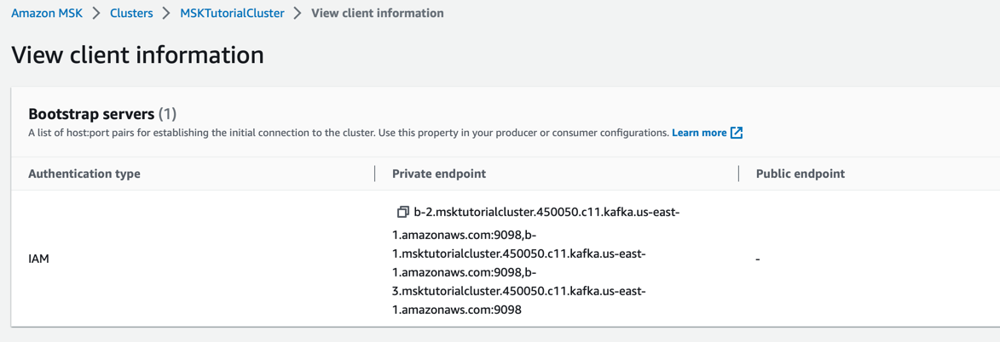

<p align="center">

</p>

In this article we create an AWS MKS Kafka resource using AWS IAM Roles 
and Policies to authenticate user access. We then create an Aeropsike 
cluster and send some sample messages to AWS Kafka via the Aerospike 
Kafka Source connector. The article is centred around using IAM to 
authenticase users and will guide the reader step by step on how to 
achieve this.
<div align="center">. . . .</div>

## AWS MKS Kafka

In this section we will setup a 3 node Kafka cluster. 
- From MSK go ahead and create a new cluster, selecting Quick Create
- Select Provisioned cluster type and select instance type kafka.t3.small
- Select the EBS storage as 10GB
- Make a note of the VPV, Subnets and the Security group ID

Next we create the IAM Policy and Roles

- Create a new IAM Policy, open the JSON tab and paste in the following replacing
  *region:Account-ID*. Save the policy with the name *msk-tutorial-policy*
```json
{
    "Version": "2012-10-17",
    "Statement": [
        {
            "Effect": "Allow",
            "Action": [
                "kafka-cluster:Connect",
                "kafka-cluster:AlterCluster",
                "kafka-cluster:DescribeCluster"
            ],
            "Resource": [
                "arn:aws:kafka:region:Account-ID:cluster/MSKTutorialCluster/*"
            ]
        },
        {
            "Effect": "Allow",
            "Action": [
                "kafka-cluster:*Topic*",
                "kafka-cluster:WriteData",
                "kafka-cluster:ReadData"
            ],
            "Resource": [
                "arn:aws:kafka:region:Account-ID:topic/MSKTutorialCluster/*"
            ]
        },
        {
            "Effect": "Allow",
            "Action": [
                "kafka-cluster:AlterGroup",
                "kafka-cluster:DescribeGroup"
            ],
            "Resource": [
                "arn:aws:kafka:region:Account-ID:group/MSKTutorialCluster/*"
            ]
        }
    ]
}
```
- Create the IAM Role. Under Common Use Cases, select EC2 and then next.
- Under permissions, select the policy named *msk-tutorial-policy* and then next.
- Give the role a name like *msk-tutorial-role* and click the Create Role button.

## Kafka Client Machine

Next we create a clinet machine where we install the Kafka tools to access our MKS cluster.

- Create an ec2 instance type t2.micro
- Use the default AMI: Amazon Linux 2023 AMI 2023.0.20230322.0 x86_64 HVM kernel-6.1
  
  - The AMI may be different at the time of reading this article
  
- Create a key pair if required
- Under [Advanced Options.IAM instance profile], select the IAM Role created earlier
- Lanuch the instance. 
- Under the instances launched, choose the instance just created. Click on the securty tab and 
  make a note of the security group associated with this instance.
  
  - e.g.: sg-0914e6271c97ae4c9 (launch-wizard-1)
  
- Open the VPC section
  https://console.aws.amazon.com/vpc/
  
- Then click on Security Groups on the left hand menu
- Find the security group from the MKS cluster and click on it.
 
  - e.g.: sg-e5f51dfb
  
- Choose edit Inbound Rules
- Create a new rule to allow all traffic from the new ec2 instance


  > 


## Kafka Topics
So we have succesfully created our Kafka cluster and Kafka Client machine so lets 
go ahead and test the access by creating a topic in Kafka, producing and comsuming messages
to confirm everything is working as expected.

- From the MSK Cluster make a note of the Kafka version being used. 
  - In this example we are using 2.8.1
- From the Kafka client machine install Java 11+
  - ```sudo yum -y install java-11```
  
- Download and untar Apache Kafka
  - ```wget https://archive.apache.org/dist/kafka/2.8.1/kafka_2.12-2.8.1.tgz```
  - ```tar -xzf kafka_2.12-2.8.1.tgz```
  
- To use IAM we will need the MSK IAM Auth jar file. Download the jar to the Kafka libs folder

  - ```cd kafka_2.12-2.8.1/libs/```
  - ```wget https://github.com/aws/aws-msk-iam-auth/releases/download/v1.1.1/aws-msk-iam-auth-1.1.1-all.jar```
  - ```cd ../bin/```
  
```bash
cat <<EOF> client.properties
security.protocol=SASL_SSL
sasl.mechanism=AWS_MSK_IAM
sasl.jaas.config=software.amazon.msk.auth.iam.IAMLoginModule required;
sasl.client.callback.handler.class=software.amazon.msk.auth.iam.IAMClientCallbackHandler
EOF
```

Go to the AWS Console and view the MSK Cluster Client Information. You will see the screen below.
There will be 3 endpoints we can use but for this illustration we only require one.
- Example choose:
  
  - ```b-2.msktutorialcluster.450050.c11.kafka.us-east-1.amazonaws.com:9098``` 




